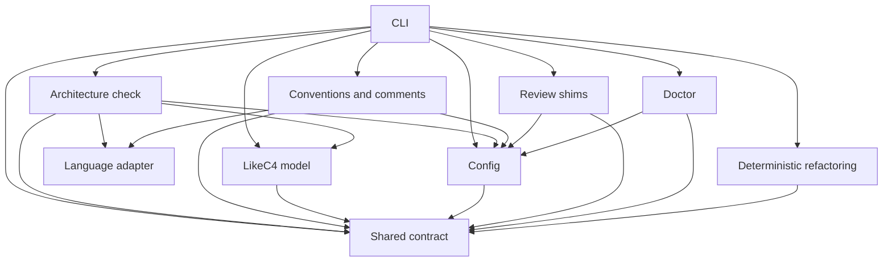

# System

## Purpose and context

The `la-*` and `dr-*` commands behind the `la` Claude Code plugin: the architecture cross-check, the
conventions gate, the review helpers and verified refactoring. Two native implementations (twins) obey one
contract in `shared/`: the PyPI package in `python/` serves Python repos, and an npm twin serves TS/JS
repos. The skills in `plugin/` drive the commands.

## Building blocks

<!-- likec4:system -->

<!-- /likec4:system -->

## Principles

1. Twins: every behaviour observable through a command is identical in both implementations for the
   languages they share; the conformance corpus decides. [enforced: test:python/tests/test_conformance.py]
2. Parameters, defaults, user-facing texts and command surfaces come only from the shared contract.
   [review]
3. Language-specific code lives only in `lang` and `refactor`. [review]
4. Tools never import or execute target-repo code. [review]

## Rationale

Each ecosystem keeps native tooling: Python repos need no Node runtime for analysis and TS/JS repos need no
Python. Only the language-neutral core is implemented twice, so the shared contract and the conformance
corpus make drift a test failure instead of a review finding. The node split is the same in both twins, and
confining language-specific code to `lang` and `refactor` keeps everything else a straight port.
