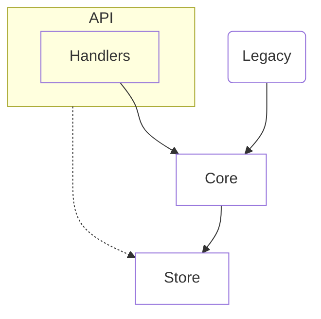

# S

1. Ok. [review]

<!-- likec4:system -->

```mermaid
flowchart TD
  %% system: System
  subgraph api["API"]
    api__handlers["Handlers"]
  end
  core["Core"]
  store["Store"]
  legacy("Legacy")
  api__handlers --> core
  core --> store
  api -.-> store
  legacy --> core
  classDef leaf fill:none;
  class api__handlers,core,store,legacy leaf;
```
*Dashed arrows: legacy edges slated to die.*
<!-- /likec4:system -->
tail
