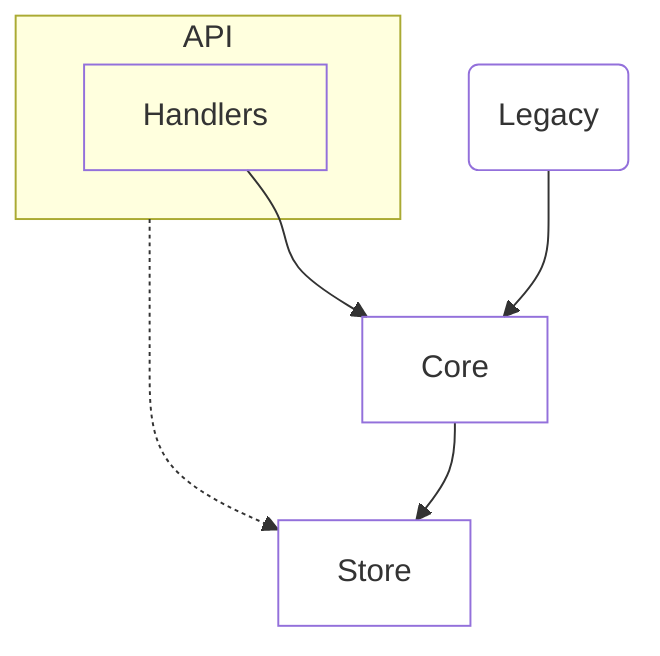

# System

## Principles

1. Handlers reach the store only through core. [enforced: arch_check:model-truth]
2. Every public function is tested.
   [enforced: test:tests/test_api.py]
3. Legacy code shrinks over time. [target: ABC-123]
4. Naming is reviewed by humans. [review]

```text
1. not a principle, inside a fence
```

## Building blocks

<!-- likec4:system -->

*Dashed arrows: legacy edges slated to die.*
<!-- /likec4:system -->
