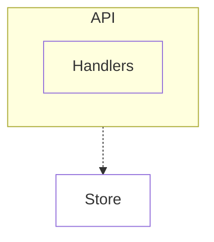

# API

1. Handlers stay thin. [review]

<!-- likec4:pair -->

```mermaid
flowchart TD
  %% pair: 
  subgraph api["API"]
    api__handlers["Handlers"]
  end
  store["Store"]
  api -.-> store
  classDef leaf fill:none;
  class api__handlers,store leaf;
```
*Dashed arrows: legacy edges slated to die.*
<!-- /likec4:pair -->
