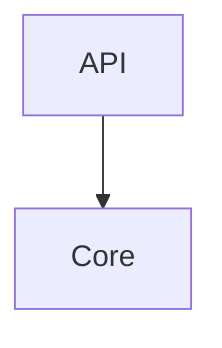
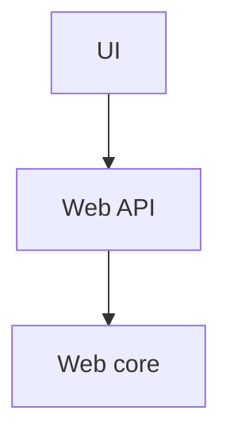

# System

1. Each language keeps its own boundaries. [review]

<!-- likec4:backend -->

```mermaid
flowchart TD
  %% backend: Backend
  api["API"]
  core["Core"]
  api --> core
```
<!-- /likec4:backend -->

<!-- likec4:frontend -->

```mermaid
flowchart TD
  %% frontend: Frontend
  api["Web API"]
  core["Web core"]
  ui["UI"]
  api --> core
  ui --> api
```
<!-- /likec4:frontend -->
