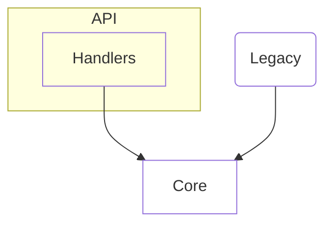
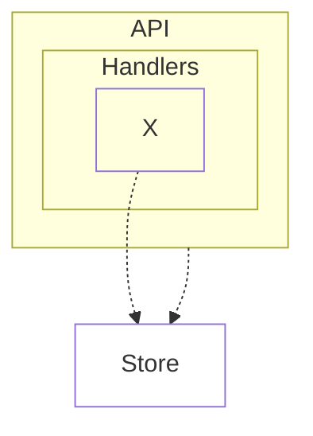
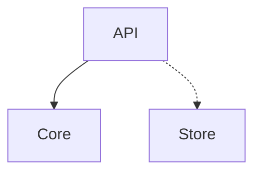

# System

1. Handlers reach the store only through core. [enforced: arch_check:model-truth]

<!-- likec4:inbound -->

<!-- /likec4:inbound -->

<!-- likec4:deep -->

*Dashed arrows: legacy edges slated to die.*
<!-- /likec4:deep -->

<!-- likec4:outbound -->

*Dashed arrows: legacy edges slated to die.*
<!-- /likec4:outbound -->
