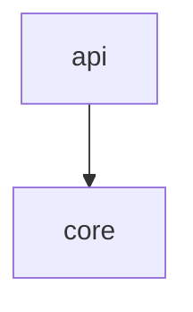
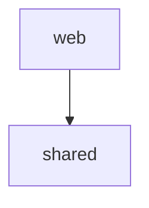

# System

## Purpose and context

TODO: what the system is for, who uses it, and what lies outside it.

## Building blocks

<!-- likec4:python -->

<!-- /likec4:python -->

<!-- likec4:typescript -->

<!-- /likec4:typescript -->

## Principles

TODO: one numbered item per principle, each with a status tag.

## Rationale

TODO: why the boundaries sit where they do.
