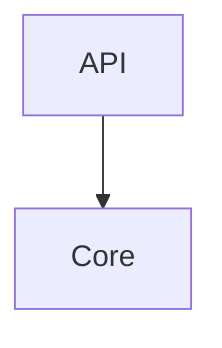
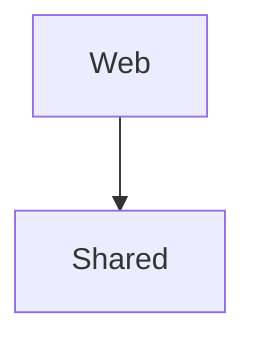

# System

## Principles

1. Imports follow the model. [enforced: arch_check:model-truth]

## Building blocks

<!-- likec4:py -->

```mermaid
flowchart TD
  %% py: Python
  api["API"]
  core["Core"]
  api --> core
```
<!-- /likec4:py -->

<!-- likec4:ts -->

```mermaid
flowchart TD
  %% ts: TypeScript
  web["Web"]
  shared["Shared"]
  web --> shared
```
<!-- /likec4:ts -->
