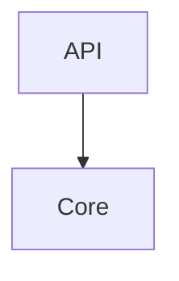
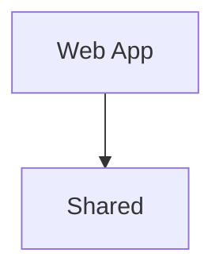

# System

## Principles

1. Each language keeps its own boundaries. [enforced: arch_check:model-truth]
2. The backend validates every request. [lang: python] [review]
3. The web app renders without the backend. [lang: typescript] [review]

## Building blocks

<!-- likec4:backend -->

<!-- /likec4:backend -->

<!-- likec4:frontend -->

<!-- /likec4:frontend -->
